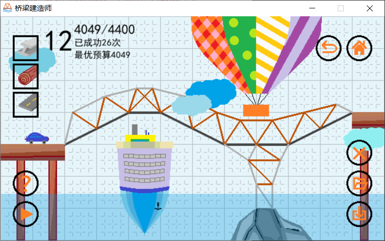

# Bridge

## 简介
这是一个模仿《桥梁建筑师》编写的单机小游戏，基于Pygame和Pymunk实现，大一下完成的课余兴趣作品

### UI
所有UI为纯手工绘制，未加渲染和抗锯齿，美工效果欠佳。游戏界面和基本交互全部基于Pygame实现。
### 物理空间
本程序基于Pymunk物理引擎，桥梁部件的动态变化由Pymunk模拟，而小车的行驶与落水是自制算法，相对比较呆板。
### 关于游戏
游戏操作说明在进入每一关卡后点击问号图标可以查看，比较简略，可以参考网络游戏《桥梁建筑师》，在功能上大幅简化，没有自动三角形、三维视觉以及其他的辅助增强效果。
获交大软件学院第14届软件展示会一等奖
